# A Handful
### Documento de diseño de videojuego
DISCLAIMER: Videojuego desarrollado para curso universitario en la UCM

Autores:
* Elena Robert Núñez (elenrobe@ucm.es)
* Enrique Juan Gamboa (enrijuan@ucm.es)
* Eduardo de Orellana Sánchez (eorellan@ucm.es)
* Gonzalo Fernández Moreno (gonzaf05@ucm.es)
* David Palacios Daza (dapala02@ucm.es)

Twitter:
@thisisademoteam

Web:
[https://ivo-hr.github.io/thisIsADemo/](https://ivo-hr.github.io/thisIsADemo/)

<table>
<tr>
    <td colspan = "2"> <b>Descripción:</b> A Handful es un juego estilo Run and Gun en el que el jugador encarna la estatua de una mano gigante. La historia de nuestro personaje comienza debido al mal mantenimiento que recibía y al trato de la gente. A causa de eso, genera un resentimiento e ira acumulado hacia los humanos y fauna local, culpables de la erosión y estado actual en el que se encuentra. Esto radica en que desarrolla consciencia y jura venganza contra los que la maltrataron. No obstante, su tiempo de “vida” es limitado, por lo que deberá darse prisa y correr por los distintos niveles, evitando enemigos y matándolos para ganar puntos. Para acabar con ellos, La mano podrá utilizar distintos power-ups en forma de distintos tipos de disparos.
 </td>
        
    
</tr>
<tr>
    <td> <b>Géneros:</b> Run and Gun </td>
    <td> <b>Modos:</b>  Single Player </td>
        
    
</tr>
<tr>
    <td> <b>PEGI: </b> 
        12
 </td>
    <td> <b>Plataformas:</b> Ordenador con navegador Chrome, teclado y ratón</td>
        
    
</tr>
<tr>
    <td> <b>Cantidades:</b>

Personajes: 1

Enemigos

 </td>
    <td> <b>Hitos:</b>

0. Propuesta del concepto: 
1. Arquitectura base: 
2. Ciclo de juego:
3. Release: 

 </td>
        
    
</tr>

</table>

### Tabla de contenidos
1. [Aspectos Generales](#aspectos-generales)  
    1.1 [Relato breve y parcial de una partida típica](#relato-breve)  
    
2. [Jugabilidad](#Jugabilidad)  
    2.1 [Mecánica](#Mecánica)   
         - [Mecánicas del personaje](#Mecánicas-personaje)  
         - [Mecánicas del escenario](#Mecánicas-escenario)  
         - [Controles](#Controles)  
         - [Cámara](#Cámara)  
    2.2 [Dinámica](#Dinámica)  
    2.3 [Estética](#Estética) 

3. [Menús y modos de juegos](#Menús)  
    3.1 [Configuración](#Configuración)  
    3.2 [Interfaz y control](#Interfaz)  

4. [Contenido](#Contenido)  
    4.1 [Historia](#Historia)  
    4.2 [Personajes](#Personajes)  

5. [Referencias](#Referencias) 

6. [Diagrama UML](#UML)

## 1. Aspectos generales 
A Handful pretende crear una experiencia de juego rápida y divertida. Con partidas relativamente cortas y rejugables y distintos niveles a superar en mapas distintos, acompañado de un sistema de puntuación que hará que el jugador quiera pensar y probar distintas estrategias para conseguir el máximo posible.

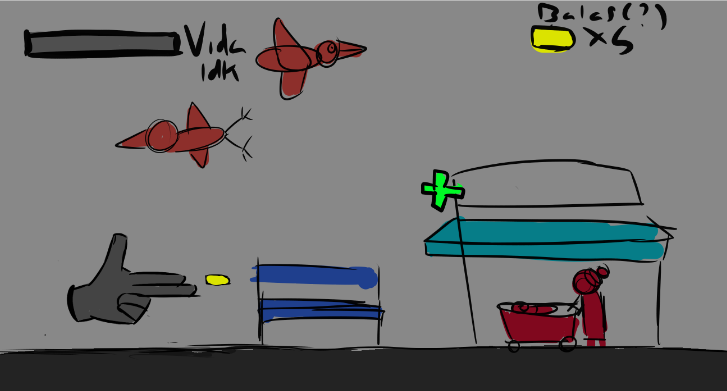

### 1.1 Relato breve de una partida típica 

El jugador inicia el juego pulsando el botón de "Jugar", el cuál lo llevará a un menú de selección de niveles. Tras elegir uno se le lleva a la posición inicial del nivel elegido y un contador de 3 segundos aparece en pantalla. En cuanto llega a cero la apartida empieza y el contador de tiempo se pone en marcha. El jugador entonces debe recorrer el nivel entero sorteando los obstáculos y enemigos mientras estos le atacan. Si los ataques le dan y su barra de vida se reduce a 0, habrá perdido. Por el camino el jugador puede recoger power-ups y derrotar a los enemigos disparándolos. Cuando llega al final la partida termina y se le indica la puntuación total, así como sus estadísticas individuales de recogida de power-ups, nivel de bondad y maldad y tiempo tardado y se le pone una nota basada en el sistema educativo americano (de F en suspenso a A en 10/10).

## 2. Jugabilidad 

### 2.1 Mecánica 

####  <a name = "Mecánicas-personaje"> Mecánicas del personaje</a>

- Mecanicas generales:
  - Vida: El jugador tiene una barra que representa la vida de la estatua, y baja cuando recibe daño de los enemigos y obstáculos. Si llega a 0 muere y pierde la partida.
  - Aire: Las mecánicas son iguales tanto si está en el aire como en el suelo (a excepción del salto), y puede llegar a usar esto en su favor.
  - Cooldown: Hay un tiempo entre disparos durante el cual el jugador tendrá mecánicas reducidas, y dependerá del tipo de disparo que use.
  - Tiempo de invulnerabilidad: Si recibe daño, el jugador tendrá un pequeño tiempo de invlunerabilidad durante el cual podrá traspasar enemigos y no podrá recibir daño.

- Mecánicas de movimiento: 
  - Movimiento lateral: El jugador puede moverse hacia la izquierda y hacia la derecha siempre y cuando no haya obstáculos en su camino.
  - Salto: El jugador puede saltar hacia arriba si está en el suelo. Cuanto más deje pulsado el botón de salto más saltará, hasta el máximo posible.
  - Bajar plataforma: Si el jugador se encuentra en un toldo puede bajar de este pulsando una tecla, traspasándolo.
  - Disparo: El jugador puede atacar a los enemigos para hacerles daño con su disparo seleccionado, el cual puede cambiar con distintos potenciadores.

| |      |
|----------------|--------------|
| 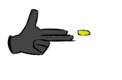         | **Modo bala.** Al estar en este estado, el jugador podrá lanzar balas. Estas balas se desplazarán en horizontal y solo se destruirán al hacer contacto contra enemigos, haciendo 1 de daño. El cooldown de disparo es de 0.5 segundos |
| 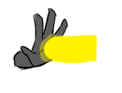         | **Modo hyperbeam.** Al estar en este estado, el jugador podrá lanzar un rayo de alto tiempo de carga, gran longitud y altura igual a la del personaje. Este rayo hará 5 puntos de daño a todos los enemigos contra los que haga contacto. El cooldown de disparo es de 5 segundos. El jugador no puede moverse mientras se ejecuta esta acción. |
| 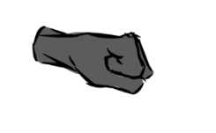         |**Modo puño.** Se lanza hacia delante a mayor velocidad, realizando 2 puntos de daño a todos los enemigos en el trayecto. Durante esta acción, no puede moverse o saltar.
|

### **Mecánicas de escenario**
El escenario contará con distintos obstáculos que no harán daño al jugador, pero que deberá sortear o utilizar a su favor:
- Bancos: Se encuentran en el suelo, el usuario puede saltar para evitarlos y usarlos para ganar algo de altura.
- Toldos: Se encuentran por encima del suelo. El usuario puede llegar a saltar con ayuda de un banco y ponerse encima de ellos, o pasar por debajo.
- Farolas: Obstáculos que resultan insorteables sin ayuda de una altura previa como un toldo, por lo que el jugador deberá tener muy en cuenta cúando bajar y cúando no. 

También habrá distintos objetos o **power ups**, los cuales se encontrarán repartidos por el escenario, estáticos. Si el jugador hace colisión con ellos, desaparecerán y le darán ventajas o cambios de habilidades, además de otorgar más puntos al final de la partida:

* Vida extra, para recuperar vida.
* Power up de cambio de habilidad, para cambiar de modo de ataque (especificado en el apartado anterior).

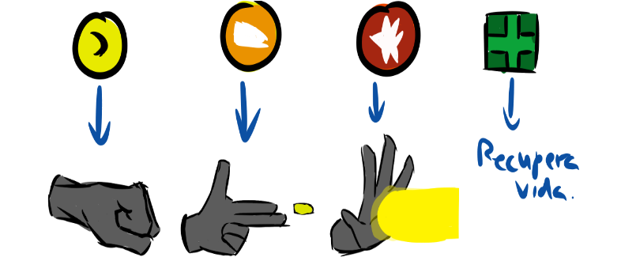

### **2.1 Controles**  

El juego está diseñado para jugar con teclado al ser un juego web.

El menú inicial antes de una partida se controlará con el ratón, pulsando los botones con el click izquierdo del ratón.

En partida el jugador dispone de controles de movimiento y ataque con los que maniobrar por el escenario:

 - Movimiento: Se realizará con las teclas de WASD
   - A/D: Moverán al jugador en esa dirección.
   - W: Hará que el jugador salte. El jugador puede moverse a la izquierda y la derecha mientras está en el aire.
   - S: El jugador bajará de la plataforma en la que esté subido. Si no está subido en ninguna no hace nada.
 - Ataque: Se atacará pulsando la tecla "Espacio".
 - Menú de pausa/ajustes: Se abrirá pulsando la tecla "Escape" y se controlará con el ratón y el click izquierdo.

### **2.2 Cámara**  

La cámara se va desplazando en scroll lateral, el jugador puede moverse pero si sale completamente de la vista de la cámara termina la partida.

## 3. Dinámica  
Para ganar en un nivel, el jugador tiene que llegar al final del mismo sin que se le agoten los puntos de vida o se salga de los límites de la cámara , independientemente de cuántos enemigos elimine.

Para perder el jugador tiene que quedarse sin puntos de vida, véase por ser atacado por enemigos o elementos del escenario. En caso de morir volverá a comenzar el nivel en el que estaba.

**Sistema de puntuación.** La puntuación de un nivel se saca en base a los enemigos eliminados y su tipo, dándose puntos adicionales por las vidas que te queden al final.

### 3.1 **Estética**  
La estética del juego será llevada a cabo con pixel art. Con una paleta de colores más bien vivos y cálidos, que contrasten con el color de la estatua que es más apagado.

## 3.2 Menús  
* Menú principal
* Menú de selección de niveles
* Pantalla gameOver
* Pantalla victoria

## 4. Contenido  
### **Historia**
Debido al mal mantenimiento de la estatua, esta genera un resentimiento acumulado hacia los humanos y fauna local, culpables de la erosión y estado actual en el que se encuentra la misma. Este resentimiento la impulsa a volverse consciente y jurar venganza contra los que la maltrataron. Sin embargo, su tiempo de “vida” es limitado, por lo que deberá darse prisa y correr por los distintos niveles, evitando enemigos y destruyéndolos para ganar puntos.

### **Niveles**
En principio el juego tendrá cuatro niveles, incrementando la dificultad  de cada uno

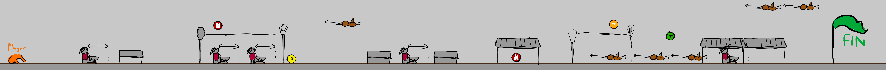

### **Personajes y enemigos**

| Enemigos |      |
|----------------|--------------|
| 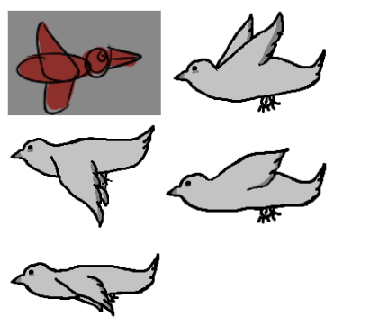        | **Pájaros:** los pájaros volarán por la parte superior de la pantalla, desplazándose de manera constante hacia la izquierda, y tirarán mierda cada 2 segundos en vertical hacia abajo, haciendo 1 punto de daño si esta colisiona con La Mano. En caso de chocar con esta le restarán 1 punto de vida. Se encuentran parados hasta que el jugador se encuentra a 20 casillas de distancia (?).|
| 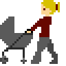         |**Señoras con carrito de bebé:** se mueven de izquierda a derecha en una zona de 3 casillas. En caso de choque con La Mano restan 2 de vida. |
| 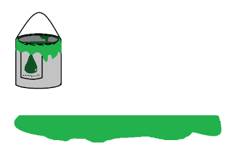         |**Botes de pintura:** al caer sobre la mano, esta recibe un 1 punto de daño y se vuelve más lenta momentáneamente, al tocar el suelo se vuelve un charco; si solo es un charco de pintura, la velocidad del jugador se reduce un X%.|
| 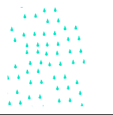         |**Lluvia ácida:** caerá en algunas zonas del nivel, desgastando periódicamente a La Mano, a razón de 1 punto de daño por cada segundo que estés bajo ella.|
| 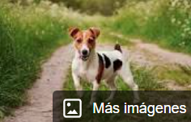         |**Perros:** se mueven hacia la derecha soltando algún truño ocasional, haciendo 1 punto de daño si La Mano lo pisa|
| 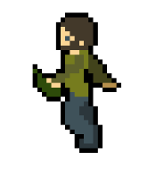         |**Borrachos:** se mueven lentamente de izquierda a derecha, con el pirulí fuera creando un arco de pis por delante de ellos, haciendo 2 de daño si este colisiona con La Mano.|
| 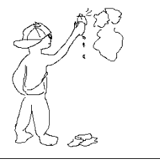         |**Grafiteros:** crean una nube de spray de pintura que dura unos segundos. Si La Mano pasa por ella es aturdida momentáneamente (no puede realizar movimientos ni habilidades) y recibe 1 de daño.|

## 5. Arquitectura y UML  
 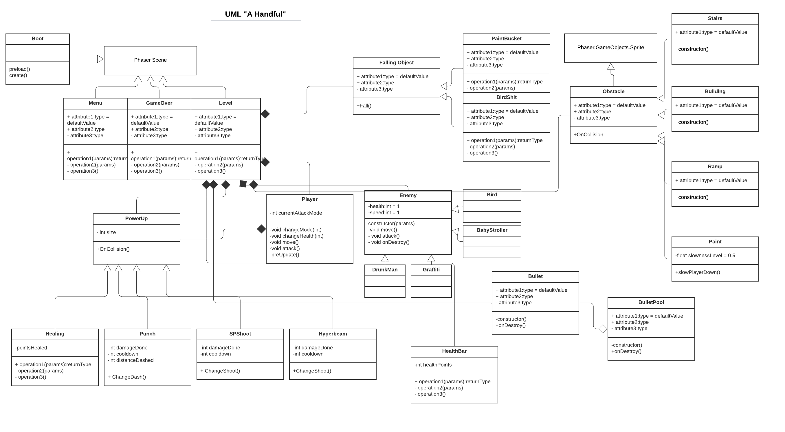

 ## 6. Assets utilizados  
(Mencionado también en apartado de estética)

La estética del juego será llevada a cabo con pixel art. Con una paleta de colores más bien vivos y cálidos, que contrasten con el color de la estatua que es más apagado.

Por el momento todos los recursos que hemos utilizado en el juego han sido creados por nosotros.
Estamos utilizando una **licencia MIT**, que se encuentra en la raíz del repositorio.

## Referencias
* Contra (NES)
* Jetpack Joyride
* Cuphead
