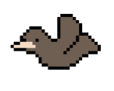
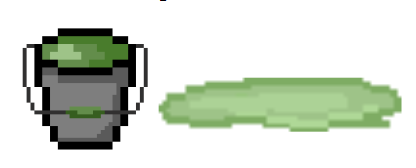
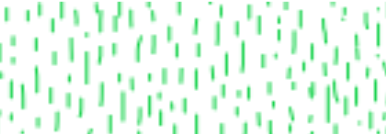

# A Handful
### Documento de diseño de videojuego
DISCLAIMER: Videojuego desarrollado para curso universitario

Autores:
* Elena Robert Núñez, elenrobe@ucm.es
* Enrique Juan Gamboa (enrijuan@ucm.es)
* Eduardo de Orellana Sánchez
* Gonzalo Fernández Moreno
* David Palacios Daza

Twitter:
@thisisademoteam

Web:
[https://ivo-hr.github.io/thisIsADemo/](https://ivo-hr.github.io/thisIsADemo/)

<table>
<tr>
    <td colspan = "2"> <b>Descripción:</b> A Handful es un juego estilo Run and Gun en el que el jugador encarna la estatua de una mano gigante. La historia de nuestro personaje comienza debido al mal mantenimiento que recibía y al trato de la gente. A causa de eso, genera un resentimiento e ira acumulado hacia los humanos y fauna local, culpables de la erosión y estado actual en el que se encuentra. Esto radica en que desarrolla consciencia y jura venganza contra los que la maltrataron. No obstante, su tiempo de “vida” es limitado, por lo que deberá darse prisa y correr por los distintos niveles, evitando enemigos y matándolos para ganar puntos. Para acabar con ellos, La mano podrá utilizar distintos power-ups en forma de distintos tipos de disparos.
 </td>
        
    
</tr>
<tr>
    <td> <b>Géneros:</b> Run and Gun </td>
    <td> <b>Modos:</b>  Single Player </td>
        
    
</tr>
<tr>
    <td> <b>PEGI: </b> 
        12
 </td>
    <td> <b>Plataformas:</b> Ordenador con navegador Chrome, teclado y ratón</td>
        
    
</tr>
<tr>
    <td> <b>Cantidades:</b>

Personajes: 1

Enemigos

 </td>
    <td> <b>Hitos:</b>

0. Propuesta del concepto: 
1. Arquitectura base: 
2. Ciclo de juego:
3. Release: 

 </td>
        
    
</tr>

</table>

### Tabla de contenidos

1. [Aspectos generales](#aspectosgenerales)
    1.  [Relato breve](#relatobreve)
2. [Mecánica](#mecanica)

## 1. Aspectos generales 
A Handful pretende crear una experiencia de juego rápida y divertida. Con partidas relativamente cortas y rejugables y distintos niveles a superar en mapas distintos.

### 1.1 Relato breve de una partida típica 

El jugador comienza una partida eligiendo un nivel en el menú principal. Tras comenzar podrá moverse de inmediato (no hay tiempo de espera ni contador antes de empezar).

El jugador debe intentar evitar todos los obstáculos a lo largo del nivel y al mismo tiempo eliminando al mayor número posible de enemigos a través de un escenario con plataformas.

## 2. Mecánicas 

### **Mecánicas de personaje**
**Movimiento horizontal.** La mano que controla el jugador podrá moverse de forma continua en dos direcciones, izquierda y derecha.

**Salto.** ¿te puedes mover en medio del salto? a cuanto más pulses más altura etc con limites?

**Barra de vida.** Contiene los puntos de vida del personaje, si llegan a 0, se acaba la partida.

**Distintos modos de disparo o ataque según power up obtenido (ver apartado 2.1.2 para comportamiento de los mismos).** El jugador comienza la partida con el Modo bala de manera predeterminada y podrá ir cambiando en el transcurso de la misma.

| |      |
|----------------|--------------|
|          | **Modo bala.** Al estar en este estado, el jugador podrá lanzar balas. Estas balas se desplazarán en horizontal y solo se destruirán al hacer contacto contra enemigos, haciendo 1 de daño. El cooldown de disparo es de 0.5 segundos |
|          | **Modo hyperbeam.** Al estar en este estado, el jugador podrá lanzar un rayo que ocupe una casilla de alto y 7 de largo. Este rayo eliminará a todos los enemigos contra los que haga contacto y durará 1 segundo. El cooldown de disparo es de 3 segundos. El jugador no puede moverse mientras se ejecuta esta acción. |
|          |**Modo puño.** Se desplaza hacia delante 1 casilla, realizando 1 punto de daño a todos los enemigos en el trayecto. Durante esta acción, no puede moverse o saltar.
|

### **Mecánicas de escenario**
El escenario contará con distintos obstáculos que no harán daño al jugador, pero que deberá sortear o utilizar a su favor:
* Bancos. Se encuentran en el suelo, el usuario puede saltar para evitarlos
* Toldos o tejados. Se encuentran por encima del suelo. El usuario puede llegar a saltar y ponerse encima de ellos, o pasar por debajo.
* Rampas. 

También habrá distintos objetos o **power ups**, los cuales se encontrarán repartidos por el escenario, estáticos. Si el jugador hace colisión con ellos, desaparecerán y le darán ventajas o cambios de habilidades:

* Vida extra, para recuperar vida.
* Power up de cambio de habilidad, para cambiar de modo de ataque (especificado en el apartado anterior).

### **Controles**

El movimiento del jugador se podrá realizar con las teclas WASD o las flechas direccionales, siendo W la tecla de salto.

Para utilizar un ataque se podrá usar la tecla P o E.

### **Cámara**

La cámara se va desplazando en scroll lateral, el jugador puede moverse pero si sale completamente de la vista de la cámara termina la partida.

## 3. Dinámica
Para ganar en un nivel, el jugador tiene que llegar al final del mismo sin que se le agoten los puntos de vida o se salga de los límites de la cámara , independientemente de cuántos enemigos elimine.

Para perder el jugador tiene que quedarse sin puntos de vida, véase por ser atacado por enemigos o elementos del escenario. En caso de morir volverá a comenzar el nivel en el que estaba.

**Sistema de puntuación.** La puntuación de un nivel se saca en base a los enemigos eliminados y su tipo, dándose puntos adicionales por las vidas que te queden al final.

### **Estética**
La estética del juego será llevada a cabo con pixel art. Con una paleta de colores más bien vivos y cálidos, que contrasten con el color de la estatua que es más apagado.

## Menús
* Menú principal
* Menú de selección de niveles
* Pantalla gameOver
* Pantalla victoria

## 4. Contenido
### **Historia**
Debido al mal mantenimiento de la estatua, esta genera un resentimiento acumulado hacia los humanos y fauna local, culpables de la erosión y estado actual en el que se encuentra la misma. Este resentimiento la impulsa a volverse consciente y jurar venganza contra los que la maltrataron. Sin embargo, su tiempo de “vida” es limitado, por lo que deberá darse prisa y correr por los distintos niveles, evitando enemigos y destruyéndolos para ganar puntos.

### **Niveles**
En principio el juego tendrá cuatro niveles, incrementando la dificultad  de cada uno

### **Personajes y enemigos**

| Enemigos |      |
|----------------|--------------|
|         | **Pájaros:** los pájaros volarán por la parte superior de la pantalla, desplazándose de manera constante hacia la izquierda, y tirarán mierda cada 2 segundos en vertical hacia abajo, haciendo 1 punto de daño si esta colisiona con La Mano. En caso de chocar con esta le restarán 1 punto de vida. Se encuentran parados hasta que el jugador se encuentra a 20 casillas de distancia (?).|
|          |**Señoras con carrito de bebé:** se mueven de izquierda a derecha en una zona de 3 casillas. En caso de choque con La Mano restan 2 de vida. |
|          |**Botes de pintura:** al caer sobre la mano, esta recibe un 1 punto de daño y se vuelve más lenta momentáneamente, al tocar el suelo se vuelve un charco; si solo es un charco de pintura, la velocidad del jugador se reduce un X%.|
|          |**Lluvia ácida:** caerá en algunas zonas del nivel, desgastando periódicamente a La Mano, a razón de 1 punto de daño por cada segundo que estés bajo ella.|
|          |**Perros:** se mueven hacia la derecha soltando algún truño ocasional, haciendo 1 punto de daño si La Mano lo pisa|
|          |**Borrachos:** se mueven lentamente de izquierda a derecha, con el pirulí fuera creando un arco de pis por delante de ellos, haciendo 2 de daño si este colisiona con La Mano.|
|          |**Grafiteros:** crean una nube de spray de pintura que dura unos segundos. Si La Mano pasa por ella es aturdida momentáneamente (no puede realizar movimientos ni habilidades) y recibe 1 de daño.|

## Referencias
* Contra (NES)
* Jetpack Joyride
* Cuphead