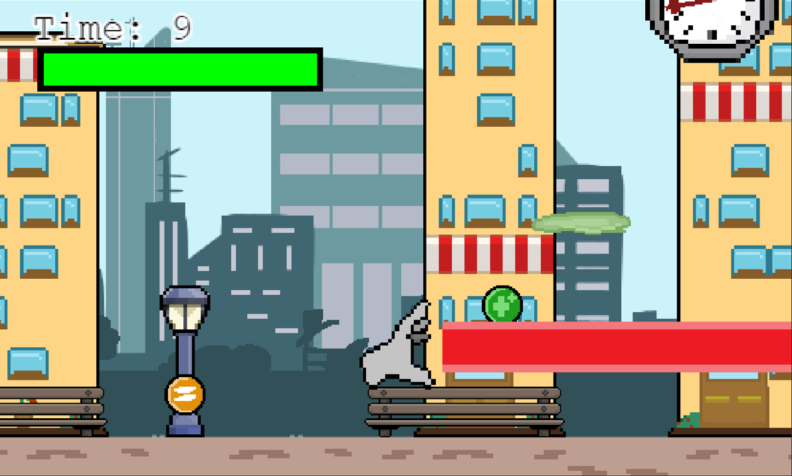
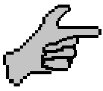
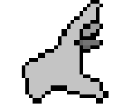
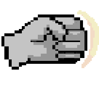
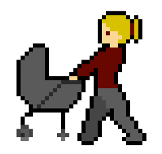
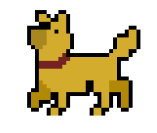

# A Handful
### Documento de diseño de videojuego
DISCLAIMER: Videojuego desarrollado para curso universitario en la UCM

Autores:
* Elena Robert Núñez (elenrobe@ucm.es)
* Enrique Juan Gamboa (enrijuan@ucm.es)
* Eduardo de Orellana Sánchez (eorellan@ucm.es)
* Gonzalo Fernández Moreno (gonzaf05@ucm.es)
* David Palacios Daza (dapala02@ucm.es)

Twitter:
@thisisademoteam

Web:
[https://ivo-hr.github.io/thisIsADemo/](https://ivo-hr.github.io/thisIsADemo/)

<table>
<tr>
    <td colspan = "2"> <b>Descripción:</b> A Handful es un juego estilo Run and Gun en el que el jugador encarna la estatua de una mano gigante. La historia de nuestro personaje comienza debido al mal mantenimiento que recibía y al trato de la gente. A causa de eso, genera un resentimiento e ira acumulado hacia los humanos y fauna local, culpables de la erosión y estado actual en el que se encuentra. Esto radica en que desarrolla consciencia y jura venganza contra los que la maltrataron. No obstante, su tiempo de “vida” es limitado, por lo que deberá darse prisa y correr por los distintos niveles, evitando enemigos y matándolos para ganar puntos. Para acabar con ellos, La mano podrá utilizar distintos power-ups en forma de distintos tipos de disparos.
 </td>
        
    
</tr>
<tr>
    <td> <b>Géneros:</b> Run and Gun </td>
    <td> <b>Modos:</b>  Single Player </td>
        
    
</tr>
<tr>
    <td> <b>PEGI: </b> 
        12
 </td>
    <td> <b>Plataformas:</b> Ordenador con navegador Chrome, teclado y ratón</td>
        
    
</tr>
<tr>
    <td> <b>Cantidades:</b>

Personajes: 1
Power-Ups: 4
Enemigos: 5
Obstáculos: 5

 </td>
    <td> <b>Hitos:</b>

0. Propuesta del concepto: 
1. Arquitectura base: 
2. Ciclo de juego:
3. Release: 

 </td>
        
    
</tr>

</table>

### Tabla de contenidos
1. [Aspectos Generales](#aspectos-generales)  
    1.1 [Relato breve y parcial de una partida típica](#relato-breve)  
    
2. [Jugabilidad](#Jugabilidad)  
    2.1 [Mecánica](#Mecánica)   
         - [Mecánicas generales](#Mecánicas-generales)  
         - [Mecánicas del personaje](#Mecánicas-personaje)  
         - [Mecánicas del escenario](#Mecánicas-escenario)  
         - [Controles](#Controles)  
         - [Cámara](#Cámara)  
    2.2 [Dinámica](#Dinámica)
         - [Sistema de puntuación](#Puntuación)  
    4.3 [Estética](#Estética) 

3. [Menús y modos de juegos](#Menús)  
    - [Menú principal](#Principal)  
    - [Menú de pausa](#Pausa)  
    - [Menú de victoria](#Victoria)  
    - [Menú de Game Over](#Over)   

4. [Contenido](#Contenido)  
    - [Historia](#Historia)  
    - [Niveles](#Niveles)
    - [Enemigos](#Enemigos)    

5. [Diagrama UML](#UML)

5. [Assets](#Assets) 

## 1. Aspectos generales 
A Handful pretende crear una experiencia de juego rápida y divertida. Con partidas relativamente cortas y rejugables y distintos niveles a superar en mapas distintos, acompañado de un sistema de puntuación que hará que el jugador quiera pensar y probar distintas estrategias para conseguir el máximo posible.

### 1.1 Relato breve de una partida típica 

El jugador inicia el juego pulsando el botón de "Jugar", el cuál lo llevará a un menú de selección de niveles. Tras elegir uno se le lleva a la posición inicial del nivel elegido y un contador de 3 segundos aparece en pantalla. En cuanto llega a cero la apartida empieza y el contador de tiempo se pone en marcha. El jugador entonces debe recorrer el nivel entero sorteando los obstáculos y enemigos mientras estos le atacan. Si los ataques le dan y su barra de vida se reduce a 0, habrá perdido. Por el camino el jugador puede recoger power-ups y derrotar a los enemigos disparándolos. Cuando llega al final la partida termina y se le indica la puntuación total, así como sus estadísticas individuales de recogida de power-ups, nivel de bondad y maldad y tiempo tardado y se le pone una nota basada en el sistema educativo americano (de F en suspenso a A en 10/10).

## 2. Jugabilidad 

### 2.1 Mecánica 

####  <a name = "Mecánicas-generales"> Mecánicas generales</a>
- Contador de tiempo: Un contador con el tiempo que lleva el jugador jugando la partida. Influenciará en el marcador total al final de esta.
- Contador de “Maldad”: Un contador que determina el “nivel de venganza” de tu partida. Aumentará con el número de enemigos eliminados a razón 1:1, y tendrá un efecto negativo sobre la puntuación total. Si este contador estuviera al máximo, sin embargo, afectará de manera positiva.
- Contador de “Bondad”: Un contador que determina el “nivel de pacifismo” de tu partida. Se verá determinado al final de la partida con el número de enemigos no eliminados a razón 1:1, y tendrá un efecto positivo sobre la puntuación total.
- Puntuación: La puntuación final de la partida se verá determinada por una fórmula formada por el daño recibido, el tiempo que ha tardado en completar la partida, el contador de bondad/maldad y los power-ups recogidos.

####  <a name = "Mecánicas-personaje"> Mecánicas del personaje</a>
- Vida: El jugador tiene una barra que representa la vida de la estatua, y baja cuando recibe daño de los enemigos y obstáculos. Si llega a 0 muere y pierde la partida.
- Aire: Las mecánicas son iguales tanto si está en el aire como en el suelo (a excepción del salto), y puede llegar a usar esto en su favor.
- Cooldown: Hay un tiempo entre disparos durante el cual el jugador tendrá mecánicas reducidas, y dependerá del tipo de disparo que use.
- Tiempo de invulnerabilidad: Si recibe daño, el jugador tendrá un pequeño tiempo de invulnerabilidad durante el cual podrá traspasar enemigos y no podrá recibir daño.
- Movimiento lateral: El jugador puede moverse hacia la izquierda y hacia la derecha siempre y cuando no haya obstáculos en su camino.
- Salto: El jugador puede saltar hacia arriba si está en el suelo. Cuanto más deje pulsado el botón de salto más saltará, hasta el máximo posible.
- Bajar plataforma: Si el jugador se encuentra en un toldo puede bajar de este pulsando una tecla, traspasándolo.
- Disparo: El jugador puede atacar a los enemigos para hacerles daño con su disparo seleccionado, el cual puede cambiar con distintos potenciadores.

| |      |
|----------------|--------------|
|          | **Modo bala.** Al estar en este estado, el jugador podrá lanzar balas. Estas balas se desplazarán en horizontal y solo se destruirán al hacer contacto contra enemigos, haciendo 1 de daño. El cooldown de disparo es de 0.5 segundos |
|          | **Modo hyperbeam.** Al estar en este estado, el jugador podrá lanzar un rayo de alto tiempo de carga, gran longitud y altura igual a la del personaje. Este rayo hará 5 puntos de daño a todos los enemigos contra los que haga contacto. El cooldown de disparo es de 5 segundos. El jugador no puede moverse mientras se ejecuta esta acción. |
|          |**Modo puño.** Se lanza hacia donde estás mirando a mayor velocidad, realizando 3 puntos de daño a todos los enemigos en el trayecto. Durante esta acción, no puede moverse o saltar.
|

#### **Mecánicas de escenario** 
El escenario contará con distintos obstáculos que no harán daño al jugador, pero que deberá sortear o utilizar a su favor:
- Bancos: Se encuentran en el suelo, el usuario puede saltar para evitarlos y usarlos para ganar algo de altura.
- Toldos: Se encuentran por encima del suelo. El usuario puede llegar a saltar con ayuda de un banco y ponerse encima de ellos, o pasar por debajo.
- Farolas: Obstáculos que resultan insorteables sin ayuda de una altura previa como un toldo, por lo que el jugador deberá tener muy en cuenta cúando bajar y cúando no.

Otros, sin embargo, sí pueden dañar al jugador:

| |      |
|----------------|--------------|
|          |**Botes de pintura:** Caen de vez en cuando desde lo alto de los edificios. Si colisionan con el jugador este recibe un 1 punto de daño y le impide realizar ataques durante unos segundos. Si impacta con el suelo se vuelve un charco de pintura el cual reduce la velocidad del jugador al pasar por encima.|
|          |**Lluvia ácida:** Caerá en algunas zonas del nivel haciendo daño por tiempo al jugador si le impacta, a razón de 1 punto de daño por segundo.|

También habrá distintos objetos o **power ups**, los cuales se encontrarán repartidos por el escenario, estáticos. Si el jugador hace colisión con ellos, desaparecerán y le darán ventajas o cambios de habilidades, además de otorgar más puntos al final de la partida:

* Vida extra, para recuperar vida.
* Power up de cambio de habilidad, para cambiar de modo de ataque (especificado en el apartado anterior).

#### **Controles**  

El juego está diseñado para jugar con teclado al ser un juego web.

El menú inicial antes de una partida se controlará con el ratón, pulsando los botones con el click izquierdo del ratón.

En partida el jugador dispone de controles de movimiento y ataque con los que maniobrar por el escenario:

 - Movimiento: Se realizará con las teclas de WASD
   - A/D: Moverán al jugador en esa dirección.
   - W: Hará que el jugador salte. El jugador puede moverse a la izquierda y la derecha mientras está en el aire.
   - S: El jugador bajará de la plataforma en la que esté subido. Si no está subido en ninguna no hace nada.
 - Ataque: Se atacará pulsando la tecla "Espacio".
 - Menú de pausa/ajustes: Se abrirá pulsando la tecla "Escape" y se controlará con el ratón y el click izquierdo.

#### **Cámara**  

La cámara tiene fijado al jugador, y le seguirá cada vez que este se desplace, tanto hacia la izquierda como a la derecha

### 2.2 Dinámica  
Para ganar en un nivel, el jugador tiene que llegar al final del mismo sin que se le agoten los puntos de vida. 

Para perder el jugador tiene que quedarse sin puntos de vida, véase por ser atacado por enemigos o elementos del escenario. En caso de morir tendrá la opción de salir al menú o volver a comenzar el nivel en el que estaba.

#### **Sistema de puntuación.** 
Al terminar el nivel el jugador tendrá una puntuación calculada en función del tiempo tardado, marcador de bondad/maldad, power-ups cogidos y daño recibido, en base a la cual obtendrá una nota. Además, según el nivel del marcador de bondad/maldad tendrá uno de tres "finales": "Pacifista" si no ha matado a ningún enemigo, "Vengativo" si ha matado a todos y "Neutral" si ha matado y perdonado, el cual se dividirá en "Solo buscas la libertad cueste lo que cueste" si hay más enemigos perdonados que eliminados y "Parte de ti quiere hacerles pagar" si es al contrario.

### 2.3 **Estética**  
La estética del juego será llevada a cabo con pixel art. Con una paleta de colores más bien vivos y cálidos, que contrasten con el color de la estatua que es más apagado.

## 3 **Menús**  
- Menú principal :
  - Botón de jugar:
    - Selección de nivel
  - Botón de Configuración
    - Volumen general
    - Volumen de música
    - Volumen de efectos
- Menú de pausa :
  - Botón de Reanudar
  - Botón de Configuración
    - Volumen general
    - Volumen de música
    - Volumen de efectos
  - Botón de Menú principal 
    - Confirmación de querer salir de la partida
- Menú de victoria : 
  - Marcadores
  - Puntuación final con nota
  - Tipo de final
  - Botón de Menú principal
  - Botón de Volver a jugar nivel
- Menú de Game Over :
  - Botón de Menú principal
  - Botón de Volver a empezar nivel

## 4. Contenido  
### **Historia** 
Debido al mal mantenimiento de la estatua, esta genera un resentimiento acumulado hacia los humanos y fauna local, culpables de la erosión y estado actual en el que se encuentra la misma. Este resentimiento la impulsa a volverse consciente, liberándose de su prisión de criatura inerte para buscar un sitio en el que descansar por fin, vengándose contra los que la maltrataron en el proceso. 

### **Niveles** 
En principio el juego tendrá cuatro niveles, incrementando la dificultad  de cada uno con un mayor número de enemigos, más obstáculos o incluso que la vida se vaya drenando poco a poco.

### **Enemigos** 

| Enemigos |      |
|----------------|--------------|
|         | **Pájaros:** los pájaros volarán por la parte superior de la pantalla, desplazándose de manera constante hacia la izquierda y subieno y bajando de forma constante, y tirarán proyetiles de caca cada 2 segundos en vertical hacia abajo, haciendo 1 punto de daño si esta colisiona con el jugador. Si un propio pájaro chocara contra el jugador le hace 2 punto de daño|
|          |**Señoras con carrito de bebé:** se mueven de izquierda a derecha en un espacio determinado. En caso de choque con el jugador le restan 2 de vida. |
|          |**Perros:** se mueven hacia un lado hasta colisionar con un obstáculo, dándose la vuelta si lo hacen. También dejan algún truño cada varios segundos, el cual se queda en el suelo y hace 1 punto de daño si el jugador lo pisa, además de ralentizarlo durante unos segundos. Si el jugador choca contra un perro recibe 1 de daño. |
|          |**Borrachos:** se mueven lentamente de izquierda a derecha de forma aleatoria, lanzándo botellas de alcohol en una parábola en intervalos de segundos aleatorios. Si una de estas colisiona con el jugador le hace 2 puntos de daño. Si el jugador colisiona con un borracho, recibe 1 punto de daño.|
|          |**Grafiteros:** Se mueven poco de izquierda a derecha y crean una nube de spray de pintura que dura unos segundos. Si el jugador pasa por ella es aturdido momentáneamente (no puede realizar movimientos ni habilidades) y recibe 3 de daño. Si el jugador colisiona con un grafitero, recibe 1 punto de daño.|

## 5. Arquitectura y UML  
 

 ## 6. Assets utilizados  
(Mencionado también en apartado de estética)

La estética del juego será llevada a cabo con pixel art. Con una paleta de colores más bien vivos y cálidos, que contrasten con el color de la estatua que es más apagado.

Todos los recursos artísticos visuales que estamos utilizado en el juego han sido creados por nosotros.

## Referencias
* Contra (NES)
* Jetpack Joyride
* Cuphead
